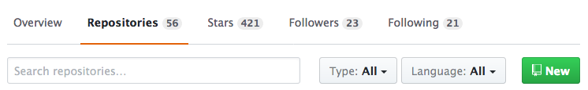

class: middle, center

# git

---

## What is git?

Git (/ɡɪt/) is a **version control system**


---

## VCS

> Version control is a system that records changes to a file or set of files<br/> over time so that you can recall specific versions later. 

— [Pro Git book](https://git-scm.com/book/en/v2)

---

## One of the reasons VCS is *A Good Thing™*

Does this seem familiar to you?

```
my-awesome-code.scd
my-awesome-code1.scd
my-awesome-code2.scd
my-awesome-code2-FINAL.scd
my-awesome-code2-FINAL2.scd
my-awesome-code2-FINAL3.scd
my-awesome-code2-FINAL2-FINAL-FOR-REALZ.scd
my-awesome-code2-FINAL2-FINAL-FOR-REALZ_001.scd
```

--
**git** can help you.

---
class: middle, center

# Basics

---

## git init

Create a new directory somewhere on your system

```
$ mkdir ~/Desktop/git-test && cd ~/Desktop/git-test
```

--
Create something for git to track

```
$ echo "This is a README" > README
```

--
Setup git in this directory

```
$ git init

-> Initialized empty Git repository in /Users/you/Desktop/git-test/.git/
```

Git is now initialized in this directory and can start to track changes to files.

It has created a hidden directory inside the folder where it keeps track of all changes, you can see it if you type `ls -la`. The git repository is entirely self contained and does not depended on any other file outside of the folder.

---

## git status

Now that we have set up git what can we do with it?

One useful command we could try is the `status` command.

```
$ git status

-> On branch master

   No commits yet

   Untracked files:
     (use "git add <file>..." to include in what will be committed)

           README

   nothing added to commit but untracked files present (use "git add" to track)
```

Nice. Git just gave us some very useful information!

It told us that we have no *commits* yet, and also that we have an *Untracked file*. Let's go ahead and `add` this file so git can start to track it.

---

## git add

Add untracked files to git using the `add` command

```
$ git add README
```

Let's ask git about its status again

--

```
$ git status

-> On branch master

   No commits yet

   Changes to be committed:
     (use "git rm --cached <file>..." to unstage)

           new file:   README
```

We can see that the status has changed. The file is now to git in a state called "staged".

In order for git to begin to track it we need to `commit` it.

---

## git commit

The `commit` command tells git that we want to record the current state of its staged files.

```
$ git commit -m "Initial commit"

-> [master (root-commit) 9319ba3] Initial commit
    1 file changed, 1 insertion(+)
    create mode 100644 README
```

We passed the `-m` flag in order to supply a commit message from the command line. Its common to call the first commit "Initial commit". The initial commit is also known as the "root commit", from where our tree of recorded changes will grow.

Let's take a look at the status again

```
$ git status

-> On branch master
   nothing to commit, working tree clean
```

All good!

---
class: center

## Life-cycle of file changes

<br/>

.center[]

---
class: center

## Summary of what we know so far

.center-table[

| Command                     | Description                          |
|:--------------------------- | ------------------------------------:|
| `git init`                  | Initialize a git repository          |
| `git add`                   | Add files for git to track           |
| `git commit`                | Commit files and/or changes to files |

]

---

class: middle, center

# Committing changes

---

## git commit

Now that we have added the README file and commited it, git will know about its state and it will tell us about any changes done to it. So let's make some changes!

```
$ echo "This is a new line" >> README
```

Git now tells us that the file has been modified.

```
$ git status

-> On branch master
   Changes not staged for commit:
     (use "git add <file>..." to update what will be committed)
     (use "git checkout -- <file>..." to discard changes in working directory)

           modified:   README

   no changes added to commit (use "git add" and/or "git commit -a")
```

---

## git diff

We can even ask git about what has changed since the last commit. Using the `diff` command.

```
$ git diff

-> diff --git a/README b/README
   index b07f0ed..0d4740e 100644
   --- a/README
   +++ b/README
   @@ -1 +1,2 @@
   This is a README
   +This is a new line
```

---

## git commit

We can now repeat our add/commit cycle to record the new changes to the file

```
$ git add README
$ git commit
```

or use an even shorter way to do the same

```
$ git commit README
```

You will notice that if we don't use the `-m` flag we will be taken to the system's $EDITOR to write the commit message. On most systems this editor is `vi` (and commonly aliased to `vim`).

Please see the next slide to get an overview on how to write a commit message in `vim`.

---

## Writing a commit message in vim

If haven't used `vim` before it may feel strange. Vim is a great editor, but it can take a while to get used to. Here are the commands that you will need to know to write a commit message and exit the editor:

1. Press `i` to enter Insert mode
2. Write your commit message
3. Press `<Esc>` to exit Insert mode
4. Type `:wq` to save and quit

---

## git log

Let's take a look at our commit history so far

```
$ git log

-> commit af257613e14044199077bfdbe6c512b8f30208b7 (HEAD -> master)
   Author: David Granström <david@davidgranstrom.com>
   Date:   Mon Nov 27 21:14:05 2017 +0100

       Add new line of text

   commit 9319ba3d14492e304e600634f89d6c470076ac0d
   Author: David Granström <david@davidgranstrom.com>
   Date:   Mon Nov 27 20:54:17 2017 +0100

       Initial commit
```

---

## git log

We can display a nice ASCII graph of the log output

```
$ git log --graph --pretty=format:"%h %d %s (%cr) <%an>" --abbrev-commit --date=relative

-> * af25761  (HEAD -> master) Add new line of text (2 days ago) <David Granström>
   * 9319ba3  Initial commit (2 days ago) <David Granström>
```

We can colorize the output

```
git log --graph --pretty=format:'%Cred%h%Creset -%C(yellow)%d%Creset %s %Cgreen(%cr) %C(bold blue)<%an>%Creset' --abbrev-commit --date=relative
```

...let's make an alias of that

```
git config --global alias.lg "log --graph --pretty=format:'%Cred%h%Creset -%C(yellow)%d%Creset %s %Cgreen(%cr) %C(bold blue)<%an>%Creset' --abbrev-commit --date=relative"
```

We can now get a colorized graph of the log output by typing `git lg`

---
class: middle, center

# Distributing

---

## git remote

Let's publish our *git-test* repository on github. 

Go to [github.com](https://github.com/). If you don't have an account there you could make one for free.

Github is one of the most popular services for open source projects as of now, but there exists others as well. Most notably [bitbucket.org](https://bitbucket.org/) which also let's you have private repositorys for free.

You could also host your own server to store remote repositories.

---

## git remote

On your github profile, go to the **Repositories** tab.



And click the **New** button

---

## git remote


Create a name for your repository, and give it an optional description.

You can also choose if the repository will be public or private (the private option is only available if you have a paid account)

As we already have an exsisting repository on our machine, we will **not** initialize the repository with a README.

Finally, click **Create repository**

---

## git remote


You will be taken to a screen with different suggestions.

As we already have an existing repository we will choose the second option: *...or push and existing repository from the command line.*

---

## git remote

Verify that you are standing inside your local repository in your terminal using the `pwd` command. It should display something like `/Users/you/Desktop/git-test`

Then copy and paste the lines from the github page (don't copy from this slide as the remote address will be something different for you)

```
$ git remote add origin https://github.com/you/git-test.git
$ git push -u origin master
```

That's it! You have now pushed your local repository to a remote repository residing on github. Refresh your browser tab to see the content of your repository.

---
class: middle, center

# Updating

---

## git push

If we continue working on our local repository and commit new changes to it, we regularly want to update our remote on github. We do that with the `push` command.

Let's create a new file

```
$ echo "Some content" > another-file
$ git add another-file
$ git commit -m "Add another file"
```
And push it to our remote (i.e. github)

```
$ git push
```

---

class: center

## Summary of what we know so far

.center-table[

| Command                     | Description                          |
|:--------------------------- | ------------------------------------:|
| `git init`                  | Initialize a git repository          |
| `git add`                   | Add files for git to track           |
| `git commit`                | Commit files and/or changes to files |
| `git log`                   | Display history                      |
| `git diff`                  | View changes                         |
| `git remote`                | Configure remote repositories        |
| `git push`                  | Push changes to remote repositories  |

]


<!-- ## git clone -->

<!-- Git is a **distributed** version control system (also known as **decentralized**), unlike many of its predecessors, git takes a *peer-to-peer* approach to version control rather than than a *client-server* approach as with centralized systems. -->

<!-- In practice, this means that each developer receives a **full** copy of the repository. --> 

<!-- To get a copy of git repository found online, we use the `clone` command. -->

<!-- Let's clone the c0dereview web site: -->

<!-- ``` -->
<!-- $ cd ~/Desktop -->
<!-- $ git clone https://github.com/C0dereview/c0dereview.github.io.git -->

<!-- -> Cloning into 'c0dereview.github.io'... -->
<!--    remote: Counting objects: 161, done. -->
<!--    remote: Compressing objects: 100% (110/110), done. -->
<!--    remote: Total 161 (delta 56), reused 116 (delta 33), pack-reused 0 -->
<!--    Receiving objects: 100% (161/161), 36.29 KiB | 571.00 KiB/s, done. -->
<!--    Resolving deltas: 100% (56/56), done. -->
<!-- ``` -->

<!-- --- -->

<!-- ## git clone -->

<!-- We now have a local copy of the c0dereview.github.io repository -->

<!-- ``` -->
<!-- $ cd c0dereview.github.io -->
<!-- $ ls -->

<!-- -> 404.html     Gemfile.lock _includes    _posts       about.md     index.md -->
<!--    Gemfile      _config.yml  _layouts     _sass        assets -->
<!-- ``` -->

<!-- From here we could for example make a new branch, commit changes, and when we're happy with our changes we could send a *pull request* (PR) to the github repository and have the changes merged into the upstream repository. -->

<!-- We will discuss all of the details for making that happen later. -->

<!-- --- -->

